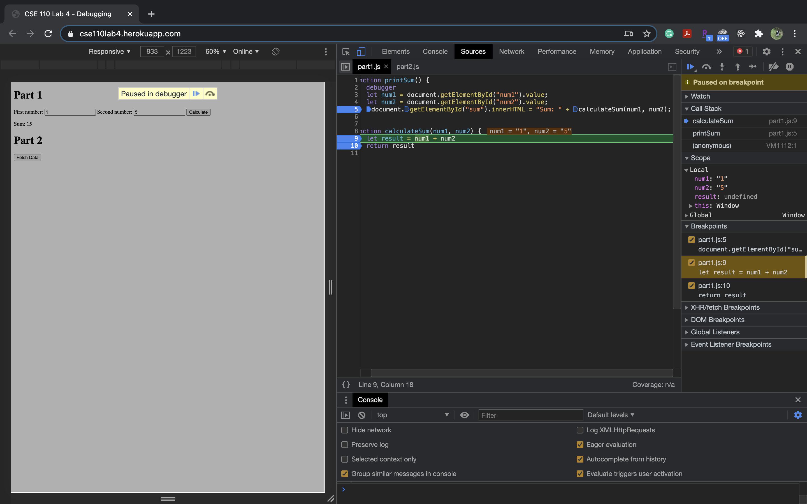
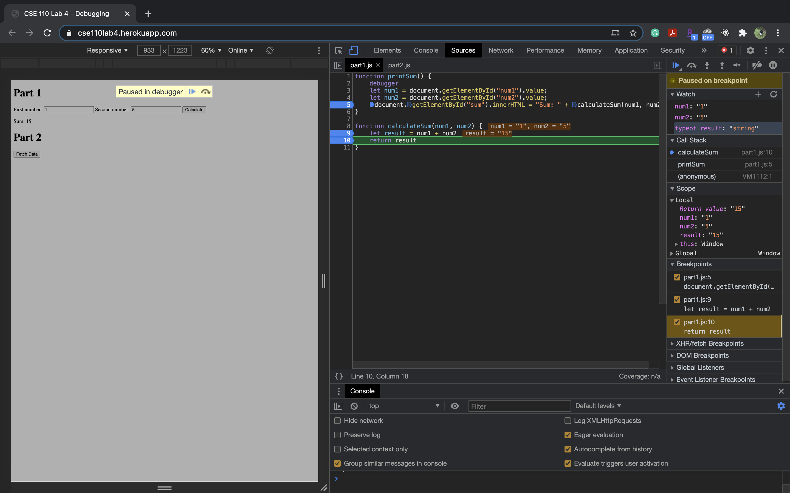
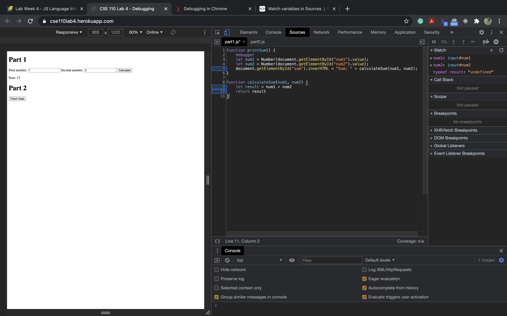

**Debugging**

screenshot of the list of breakpoints

screenshot of the watch expressions list

Questions: 

The bug was that value retrived from the user input is in the type string. 
I would fix it by converting the user input to numbers.

screenshot of the fix

**Network Tab**

1. the name of the json file is citylots.json
2. part2.js
3. the file size is 11.7MB
4. It taks 1.08s to download
5. The User-Agent is Mozilla/5.0 (Linux; Android 6.0; Nexus 5 Build/MRA58N) AppleWebKit/537.36 (KHTML, like Gecko) Chrome/88.0.4324.96 Mobile Safari/537.36
6. Apache
7. Tue, 26 Jan 2021 22:14:13 GMT
8. application/json
9. fetchData